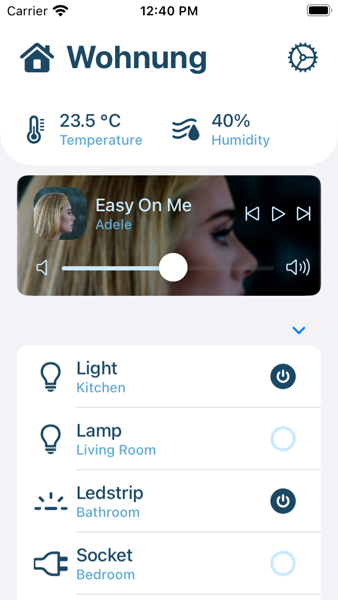
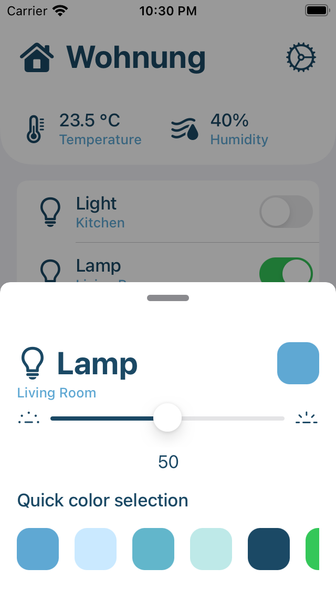
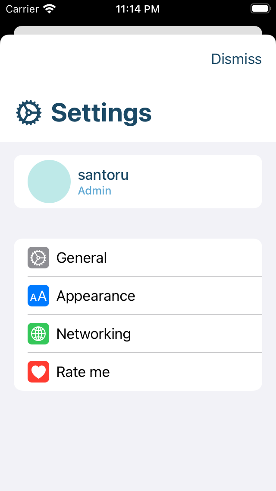

# Home Assistant - Native iOS SwiftUI Application

### Screenshots

## Disclaimer - Please read
This application is mostly a **not-working mockup** written in SwiftUI. Most of the components are **not** yet working as they are under development.
At the moment the only working features are displaying the entities and switching the lights toggle, what you can see from the application are mockup components written in SwiftUI and 'ready' to be integrated.

I am **not** an iOS developer and I started to work on this by myself to have a lightweight and fast application to do just the basics of what Home Assistant is. 
You're more than welcome to contribute and extend functionalities.

## Description
The current [Home Assistant](https://github.com/home-assistant/iOS) iOS app provides the same experience of the Home Assistant web interface along with additional features such as the device tracking integration, notifications, actions etc.
Although the Home Assistant iOS app provides the fully customizable Lovelace UI, this is not a native interface on iOS and the overall experience feels like browsing a webpage rather than using a mobile application.
Apart from the personal feeling, the native SwiftUI application has several advantage over the original Home Assistant iOS app, for example:

- Faster loading time due to native rendering of SwiftUI components
- Better resource consumption
- Improved animation responsiveness

The goal of this application is not to implement 1:1 features parity with the original Home Assistant iOS app but to have a minimal, fast and native companion app to be used to quickly monitor the status of the Home and perform basic operations on the devices.

### Known issues
- The NavigationView Sections have a collapsable button, this should not be visible

### Working components
- [x] The application will load all the entities at startup time (Entities that are not lights are hidden by default due to missing integration).
- [x] It is possible to toggle lights on/off 

### TODO List
- [ ] Implement API calls for Home Assistant (more sensors, home player, settings)
- [ ] Implement application settings to allow people to configure the application (different URL, hide components, themes etc)
- [ ] Find better icons as the SF symbols kit is limited
- [ ] Maybe implement Home Assistant login mechanism

### Palette (Default theme)
- https://coolors.co/bee9e8-62b6cb-1b4965-cae9ff-5fa8d3

## License
The [Apache 2.0](LICENSE.md) License apply

   Copyright 2021 santoru

   Licensed under the Apache License, Version 2.0 (the "License");
   you may not use this file except in compliance with the License.
   You may obtain a copy of the License at

       http://www.apache.org/licenses/LICENSE-2.0

   Unless required by applicable law or agreed to in writing, software
   distributed under the License is distributed on an "AS IS" BASIS,
   WITHOUT WARRANTIES OR CONDITIONS OF ANY KIND, either express or implied.
   See the License for the specific language governing permissions and
   limitations under the License.
